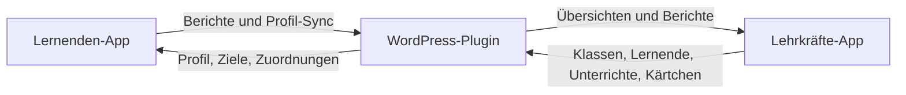
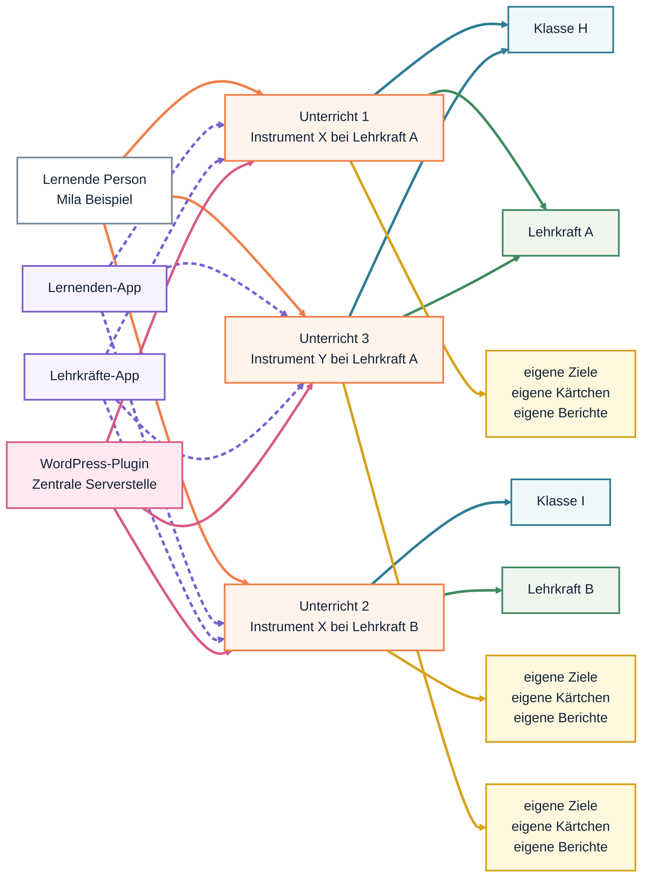
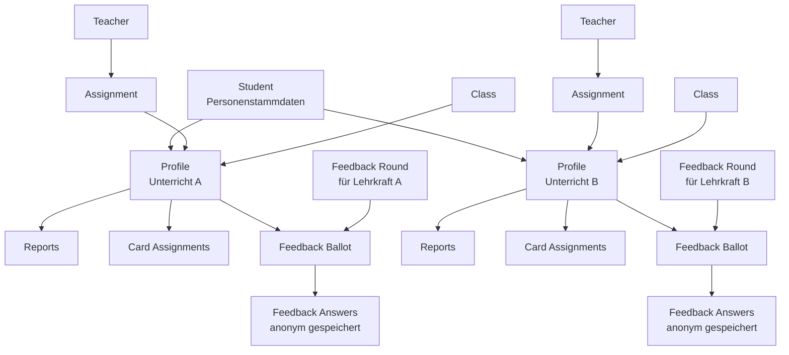

# FleißTakt

FleißTakt ist eine einfache Übe-Begleitung für Musiklernende. Die App hilft dabei, tägliches Üben sichtbar zu machen und mit kleinen Erfolgsmomenten zu verbinden. Dazu kommen eine eigene Lehrkräfte-App und ein WordPress-Plugin als gemeinsame Zentrale.

## Projektinfos

- App für Lernende: [https://marsrakete.github.io/fleisstakt/](https://marsrakete.github.io/fleisstakt/)
- Lehrkräfte-App: [https://marsrakete.github.io/fleisstakt/teacher.html](https://marsrakete.github.io/fleisstakt/teacher.html)
- Repository: [https://github.com/marsrakete/fleisstakt](https://github.com/marsrakete/fleisstakt)
- Produktlizenz: Apache-2.0, siehe [LICENSE.md](C:/Users/millenseer/OneDrive%20-%20conet.de/Projekte/FleissTakt/LICENSE.md)
- Kontakt: [millux@marsrakete.de](mailto:millux@marsrakete.de)

## Idee

Musiklernende tragen nach dem Üben kurz ein:

- wie lange sie geübt haben
- an welchem Bereich sie gearbeitet haben
- optional eine kleine Notiz

Dafür bekommen sie Rückmeldung in Form von Fortschritt, Serien und Kärtchen-Zielen. Die App soll nicht kontrollierend wirken, sondern motivieren und das Gespräch über Üben erleichtern.

## Warum WordPress als Zentrale?

FleißTakt nutzt ein eigenes WordPress-Plugin als Server-Zentrale. Das hat einen sehr praktischen Grund: WordPress ist weit verbreitet, auf vielen bestehenden Websites schon vorhanden und für viele Musikschulen, Lehrkräfte oder Träger technisch leichter zugänglich als ein komplett eigener Backend-Stack.

Vorteile dieser Entscheidung:

- große Verbreitung und bekannte Hosting-Umgebung
- einfacher Plugin-Upload auf bestehende WordPress-Installationen
- zentrale Datenhaltung für Lehrkräfte, Lernende, Unterrichte, Berichte und Kärtchen
- Web-Administration ohne eigene Server-Oberfläche außerhalb von WordPress
- gute Basis für späteren Ausbau über mehrere Geräte und mehrere Lehrkräfte hinweg

WordPress ist hier also nicht das Produkt selbst, sondern die robuste und niedrigschwellige Infrastruktur darunter.

## Wie die Kommunikation funktioniert

FleißTakt läuft im Alltag über den Server-Sync mit dem WordPress-Plugin.

Im laufenden Betrieb bedeutet das:

- Lernende synchronisieren ihre Einträge mit dem Server.
- Die Lernenden-App lädt Profil, Kärtchen und Server-Stand wieder nach.
- Lehrkräfte synchronisieren Klassen, Lernende, Unterrichte und Kärtchen mit demselben Server.
- Das WordPress-Plugin ist die gemeinsame Wahrheit für Unterrichtsbeziehungen und Zuweisungen.

## QR-Erkennung in der Lernenden-App

Für die Kopplung per QR-Code nutzt FleißTakt in der Lernenden-App zwei Wege:

- wenn verfügbar die Browser-Schnittstelle `BarcodeDetector`
- als Fallback die Bibliothek `jsQR`

`jsQR` wird lokal mit dem Projekt ausgeliefert, damit Kamera-Scan und QR-Bild-Import auch auf Geräten funktionieren, deren Browser `BarcodeDetector` nicht oder nicht zuverlässig anbietet.

Verwendete Quelle:

- Repository: [cozmo/jsQR](https://github.com/cozmo/jsQR)
- Lizenz: [Apache-2.0](https://github.com/cozmo/jsQR/blob/master/LICENSE)
- Drittanbieter-Hinweise: [THIRD-PARTY-NOTICES.md](C:/Users/millenseer/OneDrive%20-%20conet.de/Projekte/FleissTakt/THIRD-PARTY-NOTICES.md)

Für FleißTakt ist das lizenzseitig stimmig: `jsQR` steht ebenfalls unter Apache-2.0 und passt damit sauber zur Projektlizenz.

Wichtig ist nur:

- die Lizenz- und Copyright-Hinweise von `jsQR` müssen erhalten bleiben
- bei einer Weitergabe des Produkts sollte die verwendete Drittbibliothek sauber dokumentiert sein
- die Apache-2.0-Lizenz ist keine Copyleft-Lizenz

## Mandantenfähigkeit

Sobald mehrere Lehrkräfte mit derselben Installation arbeiten, muss klar getrennt bleiben, wer welche Daten sehen und bearbeiten darf. Genau das meint hier Mandantenfähigkeit.

Warum das wichtig ist:

- eine Lehrkraft soll nur die eigenen Unterrichtsbeziehungen sehen
- mehrere Lehrkräfte können denselben WordPress-Server nutzen
- Lernende können mehreren Lehrkräften zugeordnet sein, zum Beispiel für verschiedene Instrumente
- Kärtchen, Berichte und Unterrichte müssen pro Lernweg sauber getrennt bleiben

Das Plugin kann als Admin-Werkzeug alles sehen und pflegen. Im normalen Lehrkräfte-Alltag sorgt die Mandantenlogik aber dafür, dass die Lehrkräfte-App nur die passenden Daten lädt.

## Unterrichte statt nur eine Person

In der Oberfläche sprechen wir bewusst von `Unterrichten`, weil das für Lehrkräfte und Lernende verständlicher ist. Technisch dürfen diese Objekte intern `Profile` heißen.

In FleißTakt ist eine lernende Person nicht automatisch nur ein einziger Unterricht. Stattdessen trennt das System zwischen Person und mehreren konkreten Unterrichtsbeziehungen.

Kurz gesagt:

- Die `lernende Person` ist der Mensch selbst.
- Der `Unterricht` ist der konkrete Lernweg.
- Lehrkraft, Klasse, Ziele, Kärtchen, Berichte und Sync hängen am Unterricht, nicht direkt an der Person.

### Technische Sicht

Diese technische Sicht hilft bei drei wichtigen Regeln:

- `Assignments` verbinden Lehrkraft und Profil.
- `Reports`, `Kärtchen` und `Feedback-Berechtigung` laufen profilbezogen.
- Die eigentlichen `Feedback Answers` werden getrennt von der Personen-Zuordnung gespeichert, damit die Auswertung anonym bleibt.

Eine lernende Person ist der Mensch selbst:

- Vorname
- Nachname
- E-Mail
- Messenger-ID
- optionale externe ID

Ein Unterricht ist die konkrete Unterrichtsbeziehung:

- Instrument
- Unterrichtsbezeichnung
- Tagesziel
- zugeordnete Lehrkraft
- optionale Klasse
- Server-ID und Verbindungscode
- eigene Berichte und eigene Kärtchen-Ziele

Das ist wichtig, weil ein Lernender zum Beispiel gleichzeitig haben kann:

- Klavier bei Lehrkraft A
- Violine bei Lehrkraft B
- Gesang bei Lehrkraft C

Dann sind das drei getrennte Unterrichte mit jeweils eigenem Kontext, eigener Synchronisation und eigenen Zielen.

## Kärtchen und Ziele

FleißTakt nutzt motivierende Kärtchen. Diese werden durch Lehrkräfte gezielt gepflegt und zugewiesen.

Dabei gilt:

- Kärtchen können in der Lehrkräfte-App erstellt werden
- Kärtchen werden über das WordPress-Plugin zentral gespeichert
- Zuweisungen können für alle, für eine Klasse oder individuell für einen einzelnen Unterricht gelten
- die Lernenden-App zeigt im verbundenen Modus nur die wirklich zugewiesenen Ziele

So bleibt die Motivation persönlich und passend zum jeweiligen Unterricht.

## Onboarding für Lehrkräfte

Der empfohlene Ablauf für Lehrkräfte ist:

1. WordPress-Plugin installieren und aktivieren.
2. Lehrkraft im Plugin anlegen oder mit bestehendem Kontext arbeiten.
3. In der Lehrkräfte-App Klassen und Lernende anlegen.
4. Für jede Unterrichtsbeziehung einen eigenen Unterricht anlegen.
5. Lehrkräfte-App mit dem Server synchronisieren.
6. Für jeden Unterricht `Lernenden-ID` und `Verbindungscode` anzeigen, kopieren oder teilen.
7. Optional eigene Kärtchen anlegen und passenden Profilen oder Klassen zuweisen.

Wichtig dabei:

- Eine Person kann mehrere Unterrichte haben.
- Die Verteilung an Lernende läuft über die Server-Verbindung.
- Die Lehrkräfte-App ist die tägliche Arbeitsoberfläche mit Wochenansicht, das Plugin die zentrale Administration und Datenhaltung.

## Onboarding für Lernende

Für Lernende ist der Einstieg:

1. Lernenden-App öffnen oder als PWA installieren.
2. In den Einstellungen `Mit Lehrkraft verbinden` öffnen.
3. `Lernenden-ID` und `Verbindungscode` eingeben.
4. Unterricht vom Server laden.
5. Danach normal üben, Einträge speichern und mit dem Server synchronisieren.

Nach dieser ersten Kopplung kennt die App:

- Anzeigename
- Instrument
- Unterrichtsbezeichnung
- Tagesziel
- Server-Zuordnung
- zugewiesene Kärtchen

Danach genügt im Alltag der normale Server-Sync.

## Was die Lernenden-App im Alltag tut

Lernende:

- tragen Übezeit, Schwerpunkt und optional eine Notiz ein
- sehen Fortschritt, Serie und zugewiesene Kärtchen
- synchronisieren ihre Daten mit dem WordPress-Server
- können mehrere Unterrichte auf einem Gerät verwalten und umschalten

Im verbundenen Modus ist der Unterricht führend. Das bedeutet:

- Instrument und Profilkontext kommen vom Server
- nur zugewiesene Ziele werden angezeigt
- die Synchronisation läuft profilbezogen

## Was die Lehrkräfte-App im Alltag tut

Die Lehrkräfte-App ist die Arbeitsoberfläche für Unterricht und Verwaltung. Dort können Lehrkräfte:

- die aktuelle Woche pro eigenem Unterricht überblicken
- Klassen pflegen
- Lernende anlegen
- mehrere Unterrichte pro lernender Person verwalten
- Kärtchen-Ziele erstellen
- Kärtchen Klassen oder einzelnen Unterrichten zuweisen
- Daten mit dem WordPress-Server synchronisieren
- Berichte und letzte Einträge als Gesprächsgrundlage nutzen

Die Wochenansicht bündelt dabei für die laufende Woche:

- aktive und noch offene Unterrichte
- Minuten, Einträge und Notizen
- letzte Aktivität pro Unterricht
- direkt verliehene Kärtchen

Die Lehrkräfte-App ist bewusst als eigene PWA getrennt von der Lernenden-App gedacht.

## Berichtswesen

FleißTakt bietet Berichte für Woche, Monat und Gesamtzeitraum. Diese Berichte können in der App angesehen, geteilt, kopiert oder heruntergeladen werden.

Im Alltag gilt:

- Für die tägliche Zusammenarbeit ist der Server-Sync der Hauptweg.
- Die Lehrkräfte-App bekommt ihre Sicht primär über die WordPress-Zentrale.

## Ziel im Unterricht

FleißTakt soll das Gespräch über Üben verbessern:

- weg von reiner Kontrolle
- hin zu sichtbarem Fortschritt
- hin zu mehr Eigenverantwortung der Lernenden
- hin zu kleinen, motivierenden Erfolgserlebnissen

## Ausbaustufen

FleißTakt kann schrittweise wachsen, ohne den einfachen Kern der App zu verlieren.

### Stufe 1: Solider Alltag

- Einträge bearbeiten und löschen
- Kalenderansicht zusätzlich zur Listenansicht
- bessere Routine-Logik für Ferien, Pausentage oder Unterrichtsausfälle
- stabiler Sync zwischen Lernenden-App, Lehrkräfte-App und WordPress

### Stufe 2: Mehr Motivation

- weitere Kärtchen-Ziele mit kleinen Themenwelten
- Sammelalbum mit Reihen, Seltenheit und sichtbarem Fortschritt
- kleine Feiermomente beim Freischalten
- Wochenziele und Monatsziele

### Stufe 3: Mehr Begleitung durch Lehrkräfte

- kommentierbare Rückblicke zu Woche oder Monat
- Fokus-Themen für die nächste Übephase
- Zielvereinbarungen zwischen Lernenden und Lehrkräften
- kurze Notizen für die nächste Unterrichtsstunde

### Stufe 4: Mehr Vernetzung

- mehrere Geräte pro Profil
- feinere Rechte und Rollen
- weitere Mandanten- und Organisationslogik für Musikschulen
- stärkere Einbindung von WordPress als zentrale Unterrichtsplattform
