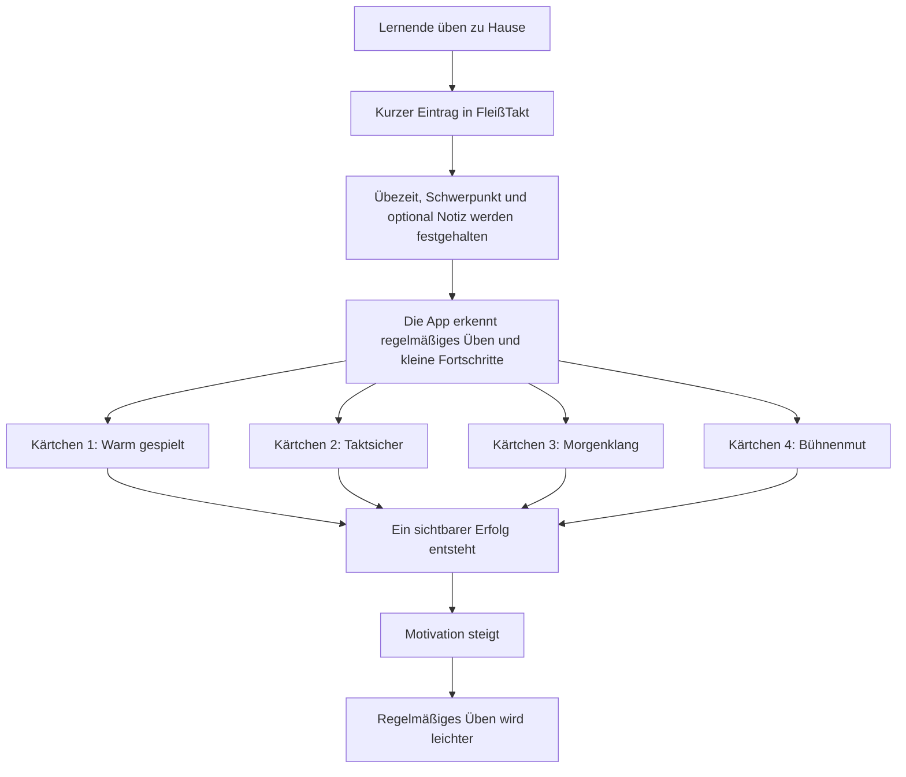
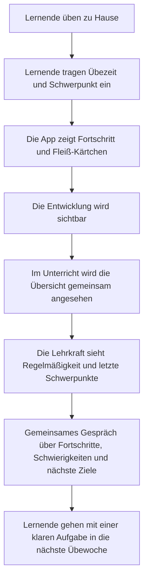

# FleißTakt

FleißTakt ist eine einfache Übe-Begleitung für Musiklernende. Die App soll helfen, tägliches Üben sichtbar zu machen und mit kleinen Erfolgsmomenten zu verbinden.

## Projektinfos

- App: [https://marsrakete.github.io/fleisstakt/](https://marsrakete.github.io/fleisstakt/)
- Repository: [https://github.com/marsrakete/fleisstakt](https://github.com/marsrakete/fleisstakt)
- Kontakt: [millux@marsrakete.de](mailto:millux@marsrakete.de)

## Idee

Musiklernende tragen nach dem Üben kurz ein:

- wie lange sie geübt haben
- an welchem Bereich sie gearbeitet haben
- optional eine kleine Notiz

Dafür bekommen sie Rückmeldung in Form von Fortschritt, Serien und sammelbaren Fleiß-Kärtchen.

Die App soll nicht kontrollierend wirken, sondern motivieren.

## Kurz erklärt in 1 Minute

FleißTakt ist eine kleine Übe-App für Musiklernende. Nach dem Üben tragen Lernende mit wenigen Klicks ein, wie lange sie geübt haben und woran sie gearbeitet haben. Auf Wunsch können sie noch eine kurze Notiz ergänzen.

Das Besondere ist: Die App arbeitet nicht mit Druck, sondern mit Motivation. Wer regelmäßig übt, sammelt Fleiß-Kärtchen und sieht seinen Fortschritt. So wird Üben sichtbarer und kleine Erfolge werden direkt belohnt.

Für die Lehrkraft entsteht daraus eine einfache Gesprächsgrundlage. Man sieht, ob regelmäßig geübt wurde, welche Schwerpunkte zuletzt wichtig waren und wie Lernende ihr Üben selbst wahrnehmen. Die App soll also nicht überwachen, sondern das Üben strukturieren und positive Gespräche darüber erleichtern.

## Wie sich die Kärtchen entwickeln



## Ablauf zwischen Lernenden und Lehrkraft



## Berichtswesen

FleißTakt bietet nicht nur eine laufende Ansicht in der App, sondern auch Berichte für die Begleitung durch Lehrkraft oder Eltern.

### Berichtstypen

- Wochenbericht
- Monatsbericht
- Gesamtbericht

Die Lehrkraft kann in der Begleitansicht auswählen, welcher Zeitraum gerade betrachtet werden soll. Alle Ausgaben beziehen sich dann auf genau diesen Zeitraum.

### Was ein Bericht zeigt

- Übezeit im gewählten Zeitraum
- aktuelle Serie
- Anzahl der Übetage
- Einträge mit Notizen
- freigeschaltete Fleiß-Kärtchen
- letzte Einträge mit Schwerpunkt und Dauer

### Welche Ausgaben möglich sind

- Bericht ansehen
- Bericht teilen
- Berichtstext kopieren
- Bericht per Mail vorbereiten
- HTML-Bericht herunterladen
- Textbericht herunterladen
- Bericht drucken oder als PDF speichern

### Wofür das sinnvoll ist

Das Berichtswesen soll nicht nur dokumentieren, sondern Gespräche erleichtern. Eine Lehrkraft kann je nach Situation schnell zwischen kurzer Rückmeldung, ausführlicher Übersicht und druckbarer Fassung wechseln.

## Aus Sicht der Lernenden

FleißTakt hilft mir dabei, mein tägliches Üben festzuhalten, ohne dass es sich wie Kontrolle anfühlt. Ich trage einfach ein, wie lange ich geübt habe, woran ich gearbeitet habe und kann mir auf Wunsch noch eine kleine Notiz dazu machen. So sehe ich schnell, was ich schon geschafft habe.

Das Motivierende daran ist: Ich sammle nach und nach Fleiß-Kärtchen. Wenn ich regelmäßig übe, morgens schon etwas mache oder öfter mit einer Notiz eintrage, werden neue Kärtchen freigeschaltet. Dadurch fühlt sich Üben nicht nur nach Pflicht an, sondern auch nach kleinen Erfolgen.

## Aus Sicht der Lehrkraft

FleißTakt gibt einen ruhigen Überblick darüber, ob Lernende regelmäßig üben und wie sich ihre Gewohnheit entwickelt. Man sieht nicht nur Minuten, sondern auch, ob eine stabile Routine entsteht, welche Inhalte zuletzt geübt wurden und ob Lernende sich Gedanken zu ihrem Üben machen.

Wichtig ist dabei: Die App soll nicht Druck machen, sondern Gesprächsanlässe schaffen. Statt nur zu fragen „Hast du geübt?“ kann man gemeinsam schauen, was schon gut läuft, wo Motivation entstanden ist und an welcher Stelle Lernende Unterstützung brauchen. Die kleine Übersicht für Lehrkräfte und Eltern ist deshalb bewusst positiv und einfach gehalten.

## Ablaufplan

### Was machen Lernende?

1. Lernende öffnen die App nach dem Üben auf dem Handy.
2. Sie tragen ein, wie viele Minuten sie geübt haben.
3. Sie wählen aus, woran sie gearbeitet haben, zum Beispiel Technik, Stück oder freies Spiel.
4. Wenn sie möchten, ergänzen sie eine kurze Notiz, zum Beispiel was gut geklappt hat oder was noch schwer war.
5. Die App speichert den Eintrag sofort.
6. Lernende sehen ihren Fortschritt, ihre Übe-Serie und neue Fleiß-Kärtchen.

### Wie kontrolliert oder begleitet die Lehrkraft?

1. Die Lehrkraft schaut sich die Begleitansicht gemeinsam mit den Lernenden an.
2. Dort sieht sie auf einen Blick:
   Regelmäßigkeit, Wochenminuten, letzte Übe-Einträge und freigeschaltete Kärtchen.
3. Die Lehrkraft erkennt dadurch:
   ob regelmäßig geübt wurde, welche Schwerpunkte gesetzt wurden und ob Lernende ihr Üben reflektieren.
4. Im Unterricht kann sie daran anknüpfen:
   Was lief gut? Wo gab es Schwierigkeiten? Welcher Bereich braucht als Nächstes Hilfe?
5. Bei Bedarf kann die Wochenzusammenfassung weitergegeben oder gemeinsam besprochen werden.

## Ziel im Unterricht

FleißTakt soll das Gespräch über Üben verbessern:

- weg von reiner Kontrolle
- hin zu sichtbarem Fortschritt
- hin zu mehr Eigenverantwortung der Lernenden
- hin zu kleinen, motivierenden Erfolgserlebnissen

## Ausbaustufen

FleißTakt kann schrittweise wachsen, ohne den einfachen Kern der App zu verlieren.

### Stufe 1: Solider Alltag

- Einträge bearbeiten und löschen
- Kalenderansicht zusätzlich zur Listenansicht
- mehrere Instrumente pro Profil
- feinere Übe-Bereiche, zum Beispiel Technik, Stück A, Stück B oder Improvisation
- bessere Routine-Logik für Ferien, Pausentage oder Unterrichtsausfälle

### Stufe 2: Mehr Motivation

- weitere Fleiß-Kärtchen mit kleinen Themenwelten
- Sammelalbum mit Reihen, Seltenheit und sichtbarem Fortschritt
- kleine Feiermomente beim Freischalten
- Wochenziele und Monatsziele
- freundliche Erinnerungen statt nüchterner Hinweise

### Stufe 3: Mehr Begleitung durch Lehrkräfte

- kommentierbare Rückblicke zu Woche oder Monat
- Fokus-Themen für die nächste Übephase
- Zielvereinbarungen zwischen Lernenden und Lehrkraft
- kurze Notizen für die nächste Unterrichtsstunde
- Berichte mit noch klarerer pädagogischer Sprache

### Stufe 4: Alltag über mehrere Geräte hinweg

- mehrere Profile auf einem Gerät
- noch geführtere Backup- und Wiederherstellungsabläufe
- Export für Gespräche, Elternabende oder Dokumentation
- optional geschützter Begleitbereich
- saubere Nutzung auf Handy und Tablet

### Stufe 5: Vernetzte Version

- Login und Cloud-Sicherung
- Freigaben für Eltern oder Lehrkraft
- gemeinsame Wochenpläne oder Aufgaben
- Auswahl, welche Berichte geteilt werden
- Nutzung über mehrere Geräte hinweg ohne manuelle Sicherung

### Empfohlene nächste Schritte

1. Einträge bearbeiten und löschen sowie eine Kalenderansicht ergänzen.
2. Das Sammelalbum und die Kärtchen-Motivation sichtbar ausbauen.
3. Die Begleitung durch Lehrkräfte mit Zielen und Rückblicken vertiefen.

## Fördermöglichkeit und sachliche Einordnung

FleißTakt kann auch als entwicklungsfähiges Vorhaben für Musikschule, Fachbereich oder Schulleitung beschrieben werden.

### Mögliche Stellen für Unterstützung

- Musikschulen oder deren Fördervereine
- kommunale Kultur- oder Bildungsförderung
- Stiftungen mit Bezug zu Bildung, Kultur oder Teilhabe
- Programme zur digitalen Unterrichtsentwicklung
- Träger aus Musikpädagogik und Jugendbildung

### Sachlicher Text für Schulleitung oder Musikschule

FleißTakt ist als niedrigschwellige digitale Begleitung für den Musikunterricht gedacht. Die App unterstützt Lernende dabei, ihr häusliches Üben einfach zu dokumentieren, Fortschritte sichtbar zu machen und regelmäßige Übegewohnheiten aufzubauen. Gleichzeitig erhalten Lehrkräfte eine ruhige, pädagogisch anschlussfähige Übersicht über Regelmäßigkeit, Schwerpunkte und Entwicklung.

Aus Sicht einer Musikschule oder Schulleitung ist FleißTakt vor allem dort interessant, wo Üben nicht nur kontrolliert, sondern als Teil eines motivierenden Lernprozesses begleitet werden soll. Die Anwendung verbindet Eigenverantwortung der Lernenden mit einer klaren Gesprächsgrundlage für den Unterricht und kann so zur Stärkung von Übekultur, Reflexion und Verbindlichkeit beitragen.

Wenn das Projekt weiterentwickelt wird, lässt es sich auch als Baustein für digitale Unterrichtsentwicklung, musikalische Bildung und zeitgemäße Lernbegleitung darstellen.

## Projektstand

Aktuell enthält der Prototyp:

- Startansicht für den Tag
- Eintragen von Übezeit und Schwerpunkt
- Verlauf der letzten Einträge
- Fleiß-Kärtchen mit Freischaltlogik
- Profilbereich
- Begleitansicht für Eltern oder Lehrkraft
- Berichte für Woche, Monat und Gesamt
- Bericht teilen, kopieren, herunterladen oder drucken

## Versionsschema

Für FleißTakt gilt ein einfaches, praktisches Versionsschema:

- `0.2.x` für Feinschliff, Textkorrekturen, Layout-Anpassungen und kleine Fehlerbehebungen
- `0.3.0` für neue Funktionsblöcke, zum Beispiel neue Einstellungen, Berichtsfunktionen oder Weiterempfehlen
- `0.4.0` und folgende für größere Ausbaustufen wie Kalenderansicht, Bearbeiten von Einträgen oder mehrere Instrumente
- `1.0.0` für eine erste rund wirkende, öffentlich vorzeigbare Kernversion

Praktische Regel:

- Patch-Versionen wie `0.2.1` für kleine Korrekturen
- Minor-Versionen wie `0.3.0` für neue Funktionen
- Major-Versionen wie `1.0.0` für einen deutlichen Reifegrad-Sprung

## Lokal starten

```powershell
.\start-server.ps1
```

Danach ist die App im Browser erreichbar, zum Beispiel unter:

```text
http://localhost:5000/
```
